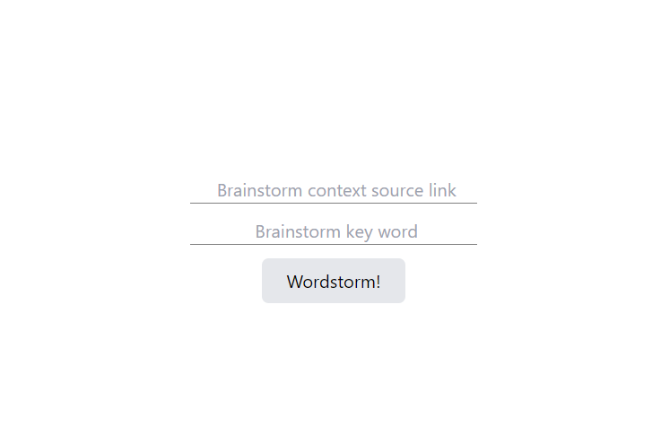
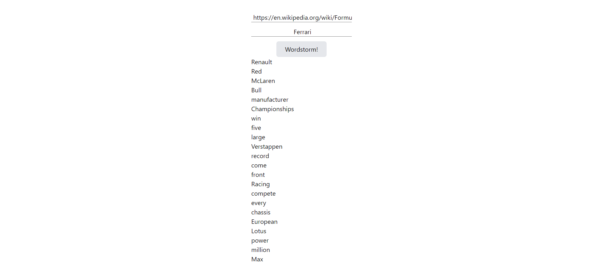

# word-storm
\*currently work in progress\*

through user's choice of source link and keyword, outputs words that share contextual similarities

used: typescript, react.js, tailwindcss, python, flask, beautifulsoup, word2vec, nlp, nltk

### steps

- scrapes data from source link using Beautiful Soup, converting HTML to text
- uses NLP and Spacy for interpreting extracted text
- using Word2vec technique, generate list of words similar to target word based on contextual relevance
- integrates NLTK to exclude irrelevant words (stopwords) from output list

### use cases?

- was inspired by the brainstorming technique and could be of assistance

### potential improvements in the future

- [ ] pre-trained model to save time
  - ex: Google News dataset (about 100 billion words). The model contains 300-dimensional vectors for 3 million words and phrases.
  - https://www.kaggle.com/datasets/leadbest/googlenewsvectorsnegative300/code
- [ ] different forms of user input aside from link
  - ex: file, big text form, etc.
- [ ] better ui
- [ ] change to preprocess text instead of cleaning afterwards
- [ ] experiment with different parameters for word2vec model for better combination
- [ ] specify error message

### how to?

- `cd frontend`
- `npm start`
- open new terminal
- `cd backend`
- `py app.py`
